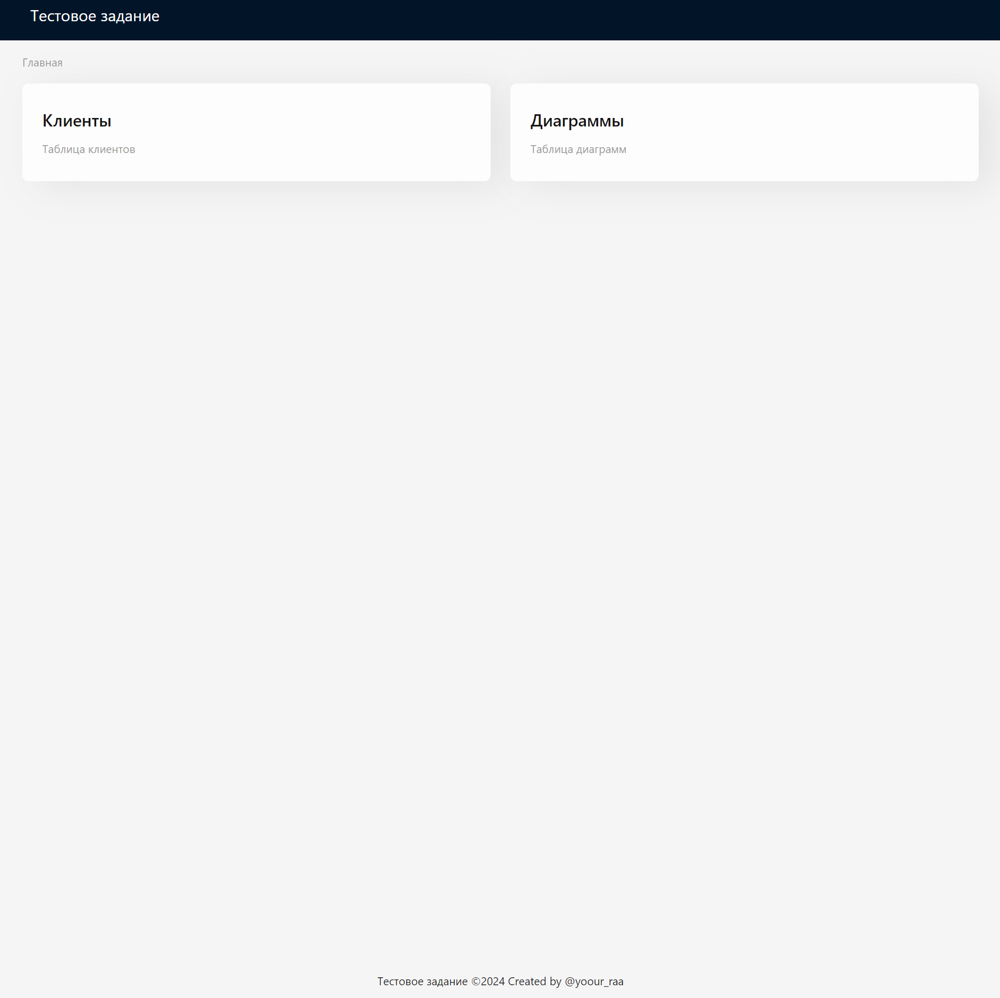
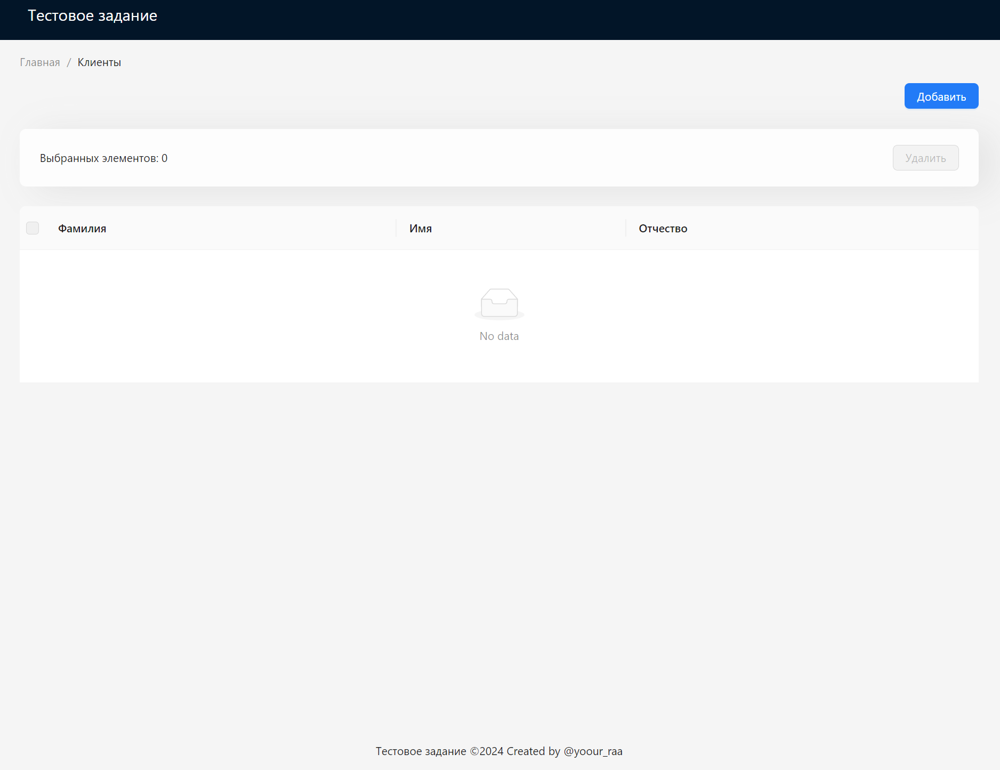
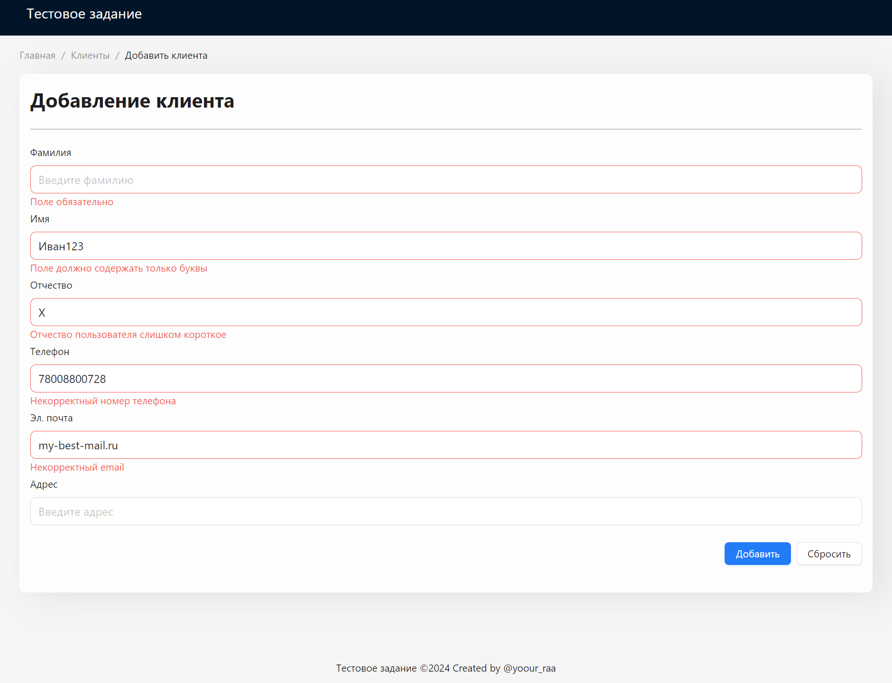
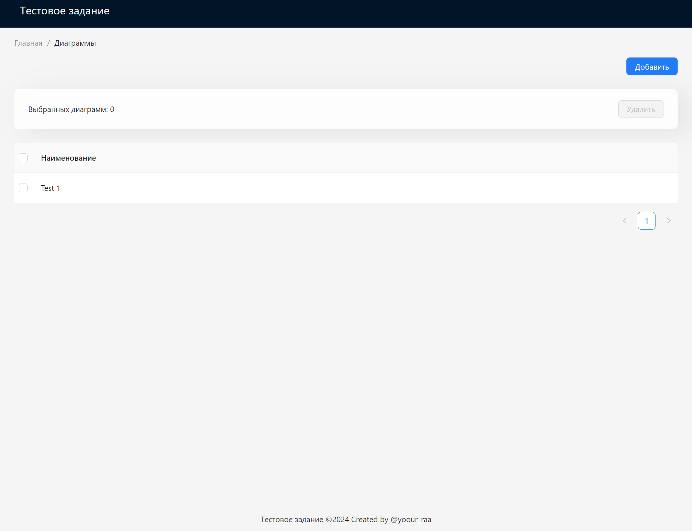
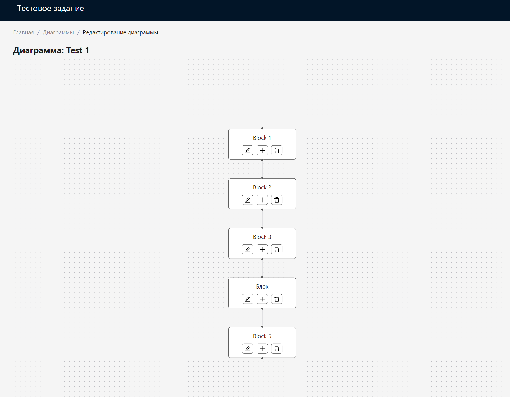

# Тестовое задание

### Установка и запуск приложения:

#### Dev-режим

```bash
npm ci && npm run dev
```

#### Prod-режим

```bash
npm ci && npm run build
```

#### Главная страница

#### path: '/'

С данной страницы вы можете перейти к страницы с таблицами клиентов или диаграмм



#### Таблица клиентов

#### path: '/clients'

На этой странице отображаются все пользователи, также можно создать нового клиента или удалить его



#### Страница добавления/изменения нового клиента

#### path: '/clients/create' or '/clients/edit/:id'

На этой странице представлено несколько полей для ввода, каждое поле проходит валидацию, у каждого поля есть несколько правил для проверки пользовательского ввода



#### Таблица диаграмм

#### path: '/diagrams

На этой странице отображаются все диаграммы, также можно создать новую диаграмму или удалить ее



#### Таблица диаграмм

#### path: '/diagrams/edit/:id'

На этой странице отображается диаграмма, состоящая из нод, ноду можно удалить, изменить или добавить новую. Если у ноды несколько потомков, то при удалении они тоже будут удалены



